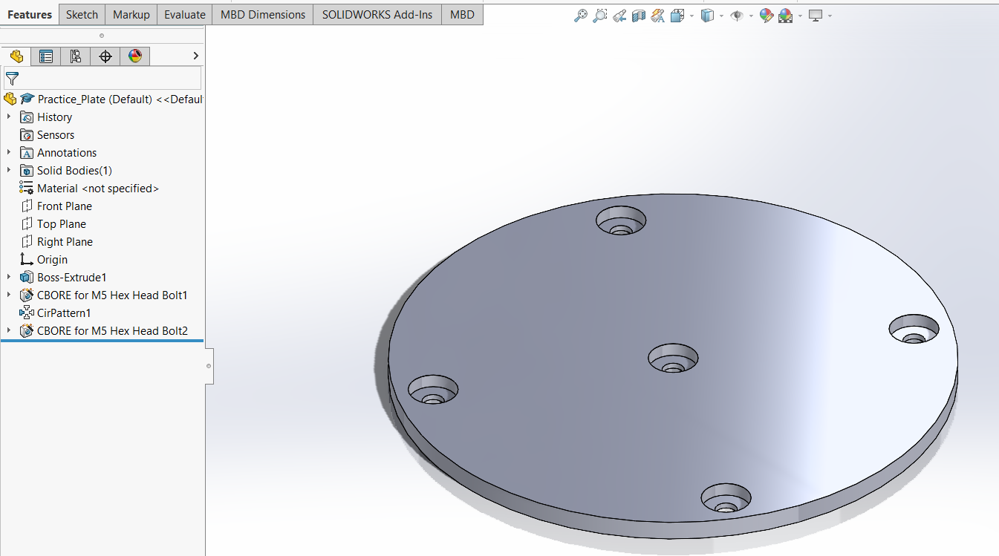

# Noise-Canceling Fan Devlog

Welcome to the Noise-Canceling Fan DevLog! This is a running summary of daily work on this project.

---

## 06-29-2025

**Done**  
- Created Repo and README  
- Brainstormed high-level design: 3D printed hollow rectangular base with four supports, speaker on the front face, microphone hole on the top face, fan housed in horizontal cylinder supported by cylindrical column from base. Electrical housed under the base.

**Learned**  
- GitHub repo organizations for engineering projects.

**Next**  
- Order parts (mic, speaker, Teensy, etc), CAD practice, write project specifications.

---

## 06-30-2025

**Done**  
- Ordered parts (microcontroller, fan, electronics)

**Learned**  
- Electronics required (amplifier module, barrel jack adapter, etc)

**Next**  
- Write spec, BOM, CAD practice

---

## 07-02-2025

**Done**  
- Got hung up on internship work. Watched one SolidWorks recap video.

**Next**  
- CAD practice, first models.

---

## 07-03-2025

**Done**  
- Completed SolidWorks recap video

**Learned**  
- Reviewed SolidWorks basics (sketching, boss/revolve, shell, fillet)

**Next**  
- Begin practice parts

---

## 07-06-2025

**Done**  
- Created horizontal “lampshade” example from SolidWorks part modeling tutorial utilizing sketch, extrude, extrude-cut, shell, and fillet.  
  - [Practice_Lampshade.SLDPRT](../CAD/Practice_CAD/Practice_Lampshade.SLDPRT)  
- Created circular baseplate to practice HoleWizard  
  - [Practice_Plate.SLDPRT](../CAD/Practice_CAD/Practice_Plate.SLDPRT)

  
  

**Learned**  
- More thorough review of SolidWorks basics and learned about HoleWizard.

**Next**  
- Continue practice parts

---

## 07-07-2025

**Done**  
- Revisited design. Original model with speaker on front of base was deemed nonfunctional. Learned that noise canceling needs good alignment of fan noise to noise canceling output from speaker. Redesigned to include speaker pointing directly into cylindrical fan shroud. Brainstormed horizontal plate that separates direct line of sight from speaker to mic inside shroud chamber.

**Learned**  
- [AMCA Basics of Fan Noise Presentation](https://www.amca.org/assets/resources/public/assets/uploads/FINAL-_AMCA_Fan_Noise_RG.pdf)  
- [Noise Canceling Case Study](https://www.diva-portal.org/smash/get/diva2%3A831430/FULLTEXT01.pdf)  
-  Design requires **iteration**. Every single idea/design will have issues that come up and need to be addressed.

**Next**  
- Begin CAD for base, support tube, and shroud

---

## 07-09-2025

**Done**  
- Began base: 160 × 160 × 25 mm with a 5.5 mm thick lip running along the inner face of box for lid to sit flush.

  

**Learned**  
- How to insert planes.

**Next**  
- Continue CAD for base, begin support tube, cylindrical shroud, round sleeve for fan.

---

## 07-12-2025

**Done**  
- Completed prelim design for base box. Used cut extrude from various planes within the box to create a lip on inside edge that will allow lid to sit flush with top.

  

**Learned**  
- Learned how to insert plane at specific height. 

**Next**  
- Begin CAD for lid, support tube, and shroud.

---

## 07-15-2025

**Done**  
- Completed design for lid (157.5 × 157.5 × 6.5 mm). Thickness allows flange from tube to sit into lid comfortably.
- Completed design for support tube: 70 × 70 mm cylinder with 3 mm wall thickness. Added 82 mm diameter, 2.5 mm thick flange around bottom of tube. Added 82 mm diameter, 2.5 mm deep recess into lid to allow tube to fit. Added four M4 tapped holes on a 76 mm diameter circle to flange, and clearance holes for brass inserts.

  

**Learned**  
- Refreshed skills with basic extrude. Began GD&T, designing one part to fit into another.  
- Refreshed skills with HoleWizard. Learned screw size selection and technique for press fitting brass inserts.

**Next**  
- Begin CAD for fan housing plates and shroud

---

## 07-18-2025

**Done**  
- Created circular plates for front and back of fan to fit into cylindrical shroud.   
  - OD: 208 mm, thickness: 4 mm.  
  - Hole pattern: 4 × 4.45 mm holes on 124 × 124 mm square. Front plate counterbored (Ø 8 mm) for flush screws. Back plate holes Ø 5.7 mm × 3.5 mm deep with 0.5 mm skin for brass inserts.  
  - Central cutout: Ø 140 mm, filleted inner edges, chamfered outer edges (0.5 mm × 45°).
  - [Fan_Front_Plate.SLDPRT](../CAD/Project_CAD/Fan_Front_Plate.SLDPRT)  
  - [Fan_Back_Plate.SLDPRT](../CAD/Project_CAD/Fan_Back_Plate.SLDPRT)

  
  

**Learned**  
- How to apply real-world dimensions (fan specs) to a CAD problem.

**Next**  
- Begin CAD for shroud.

---

## 07-21-2025

**Done**  
- Revisited box design: inner lip was only 3.5 mm, not 6.5 mm. Revised box depth to 35 mm. Fixed wall thickness (3 mm intended) by revising lid to 153.5 × 153.5 mm and changing extrude cut dimensions on box.
- Added cylindrical 8mm support feet to box base for rubber feet coverings.  
- Began shroud development: finalized component dimensions within shroud (baffle, speaker, mic, plates, stopper ring). Shroud thickness: 3 mm.  
- [Box_FINAL.SLDPRT](../CAD/Project_CAD/Box.SLDPRT)

  

**Learned**  
- Revisiting previously completed parts is important—design and dimensions may change based on interactions.

**Next**  
- Continue shroud development and figure out mate with vertical tube.

---

## 07-23-2025

**Done**  
- Cleaned up project documentation. Filled in missing entries.

**Next**  
- Continue shroud development and figure out mate with vertical tube.

---

## 07-26-2025

**Done**  
- Further developed shroud design. Created baffle that blocks direct line of sight from speaker at top of shroud to mic at bottom. Drafted speaker hole on top of shroud: created boss on angled plane, then extruded cut flush to create speaker pocket.

  
  

**Learned**  
- How to angle planes and insert reference features (axes, planes) in relation to other features.

**Next**  
- Continue shroud development and figure out mate with vertical tube.

---

## 07-27-2025

**Done**  
- Further developed shroud design. Finalized extruded cut to form speaker ledge within top extrusion. Ensured that a 60 degree projection from the fan center does not hit the shielding baffle. This prevents reflection and excess vibrations. Reflections and subsequent comb filtering can result in reverberations and poor ANC.

  
  

**Learned**  
- [Basics of comb filtering](https://www.dpamicrophones.com/mic-university/audio-production/the-basics-about-comb-filtering-and-how-to-avoid-it/).  
- Reflections and reverberations are harmful.

**Next**  
- Continue shroud development and figure out mate with vertical tube.

---

## 07-28-2025

**Done**  
- Further developed shroud design. Finalized extruded cut to form speaker ledge within top extrusion. Ensured that a 60 degree projection from the fan center does not hit the shielding baffle.  

  
  

**Learned**  
- [Basics of comb filtering](https://www.dpamicrophones.com/mic-university/audio-production/the-basics-about-comb-filtering-and-how-to-avoid-it/).  
- Reflections and reverberations are harmful.

**Next**  
- Continue shroud development and figure out mate with vertical tube.

---

## 07-30-2025

**Done**  
- Finalized shroud design. Added 15 mm diameter circular recess in bottom of shroud for microphone array. Extrude cut hole for microphone wiring that goes into tube and down into base. Decided on two piece shroud and tube. Shroud has extrusion on the bottom that fits into the tube and will be glued.
- Compiled tube and shroud into an assembly. Changed extrusion of tube to "up to next" to get it flush with the shroud.

  
  
  

**Learned**  
- Extrude "up to next" is very useful for getting features flush with one another.  
- Consulted coworker on one piece vs two piece shroud + tube. One piece would have wasted a lot of support material.

**Next**  
- Continue Prints!

---

## 08-02–08-08-2025

**Done**  
- On vacation, updated resume, documentation. 

---

## 08-10-2025

**Done**  
- Retrieved prints and physically fit together lid and base. Lid was slightly smaller than base lip area, so purchased set screw from Menards and heat set insert into base.
- Began print of shroud and initial tube.

**Learned**  
- Asked R&D Technician at my internship about tolerance and sizing issue:
  - Even though GD&T is conducted on CAD and tolerances are set, machined or printed product often deviates. Thus you need to check machining/printing quality before starting (create 5x5x5 mm cube with printer and measure actual size, then adjust CAD).

**Next**  
- Retrieve prints of shroud and tube, and assemble.

---

## 08-14-2025

**Done**  
- Retrieved print of shroud and tube. Added 6-32 screws and inserts to the mate between tube flange and lid recess.
- Shroud print had stray filament, so I sanded down rough areas.
- Drilled hole through lid and tube bottom to allow for mic wires to pass through.
- Shroud fit well into tube, but the shroud mouth was turned rather than straight on due to fit with the tube profile. Redesigned tube in SolidWorks to ensure shroud mouth points straight.

  
  
  

**Learned**  
- Even though GD&T is conducted on CAD and tolerances are set, machined or printed product often deviates. Thus you need to check machining/printing quality before starting (create 5x5x5 mm cube with printer and measure actual size, then adjust CAD).

**Next**  
- Reprint tube and refit with shroud.

---

## 08-21-2025

**Done**  
- Reprinted second tube and fit properly with shroud. Began print of front and back fan housing plates. Repainted shroud with black paint to cover sanding marks. Unscrewed previous tube from lid and attached new one. 

**Learned**  
- Sanding causes markings on plastic. 

**Next**  
- Fit fan into plates and press fit into shroud.

---

## 08-27-2025

**Done**  
- Retrieved prints of plates and mounted to fan using M5 machine screws and wing nuts. Press fitted very well into shroud!

  
  

**Learned**  
- Sanding causes markings on plastic. Polishing/repainting may be necessary.  

**Next**  
- Begin Bench Testing!

---

## 09-02-2025

**Done**  
- Began bench testing. Assembled Teensy 4.1 on breadboard, 12V barrel jack adapter, microphone module, amplifier module, and speaker.
- Cut and stripped wires at the barrel jack. Split neutral wire and soldered in a Y config. The first wire from the wall plug goes to a common junction connected to the breadboard GND rails. The second wire from the split goes to the fan plug negative terminal.
- Soldered blue and red jumper wires to the 12V supply hot and neutral wires to power the fan.
- Soldered mic module to jumper wires and plugged into breadboard (SEE WIRING DIAGRAM).
- Attached speaker to amp module using jumper wires.

  
  
  
  

**Next**  
- Continue bench testing.
