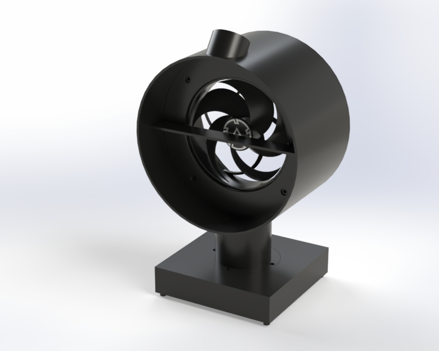
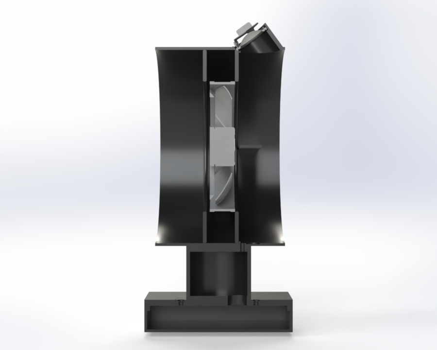

# Noise Canceling Fan Project (IN PROGRESS)

A desktop fan that cancels its own noise using active noise cancellation, built utilizing CAD, embedded programming, signal processing, and acoustic analysis to create a standalone product! 

  
  

---

## What It Does

This fan detects its own blade-generated noise using a microphone, identifies the dominant frequency using an FFT (Fast Fourier Transform), and cancels it in real time by outputting inverted sound through a speaker

---

## How it Works  
1. The microcrophone and Teensy microcontroller communicate using I2S
2. The noise data that is sent to the microcontroller from the mic is processed by an FFT (Fast Fourier Transform) in the PJRC Audio library.
   - This identifies the specific frequency of noise with the highest amplitude
4. Once the specific frequency is identified, the tone is phase shifted 180 deg and played out of the speaker using AudioConnection 
5. A simple hill-climb/coordinate descent algorithm reads the FFT again and nudges the phase + amplitude of the anti-tone up and down until a minimum is achieved.  

---

## Testing 
- Ran modal FEA to ensure that the housing doesn't resonate at the fan's blade pass frequency of 172 Hz.
    - Found main vibrational modes at XXX and XXX Hz. Well out of range for resonance.
- Conducted bench testing
    - Wired Teensy, speaker + amp, microphone, and fan together. Consolidated grounds and ensured that microphone can record audio that can be played out of the speaker. Also ensured that fan can be properly controlled via PWM. Script is in [Coding folder](
## Status/Next Steps
- Bench testing is now complete. All components - speaker, mic, Teensy, and fan connect to each other and are functonal on the breadboard and mechanically fit into the shroud and base. 
- Next steps will be rewiring everything into the 3D printed housing, taking decibel measurements, refining the algorithm (implement active FxLMS, possibly replace FFT with Goertzel), and creating a PCB to replace the breadboard.

---

## CAD Model Links
| [Part](link)                                                      |   Description  
| [Box](CAD/Project_CAD/box.SLDPRT)                                 |   Box that forms the base. Houses electronics.   
| [Lid](CAD/Project_CAD/lid.SLDPRT)                                 |   Lid that fits flush with top of base. Mounts to support tube with screws.  
| [Support_Tube](CAD/Project_CAD/tube.SLDPRT)                       |   Vertical support tube that rises from lid to shroud. Houses wiring.   
| [Fan_Housing_Front_Plate](CAD/Project_CAD/Fan_Front_Plate.SLDPRT) |   Circular plate that sits in front of fan to create circular profile to fit into shroud.   
| [Fan_Housing_Back_Plate](CAD/Project_CAD/Fan_Back_Plate.SLDPRT)   |   Circular plate that sits in behind fan to create circular profile to fit into shroud.   
| [Fan_Shroud](CAD/Project_CAD/Shroud.SLDPRT)                       |   Horizontal cylinder that houses fan, microphone, and speaker. Connects to support tube at bottom.      
| [Final_Assembly](CAD/Project_CAD/Final_Assembly.SLDPRT)           |   Final assembly of shroud, tubewith holes, lid, and base.
