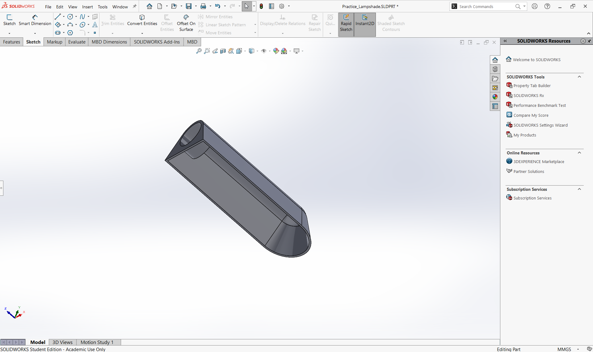

**
LINKS
[README](../README.md)  
[Spec](Spec.md)   
**

<<<<<<< HEAD
## Welcome to the Noise-Canceling Fan DevLog! This is a running summary of daily work on this project. 
=======
## Welcome to the Noise Canceling Fan DevLog! This is a running summary of daily work on this project. 
>>>>>>> parent of eeab3cb (-)

## 06-16-2025 (Mon)
**Done**
- Created Repo and README
<<<<<<< HEAD
- Brainstormed high-level design: 3D printed hollow rectangular base with four supports, speaker on the front face,
=======
- Brainstormed high level design: 3D printed hollow rectangular base with four supports, speaker on the front face,
>>>>>>> parent of eeab3cb (-)
 microphone hole on the top face, fan housed in horizontal cylinder supported by cylindrical column from base. Electrical housed under the base. 

**Learned**
- GitHub repo organizations for engineering projects. 

**Next**
<<<<<<< HEAD
- Order parts (mic, speaker, teensy, etc), CAD practice, write project specifications. 
=======
- Order parts (mic, speaker, teensy etc), CAD practice, write project specifications. 
>>>>>>> parent of eeab3cb (-)

------------

## 06-17-2025 (Tues)
<<<<<<< HEAD

**Done**
 - Ordered parts (microcontroller, fan, electronics)
=======
**Done**
-Ordered parts (microcontroller, fan, electronics)
>>>>>>> parent of eeab3cb (-)

**Learned**
- Electronics required (amplifier module, barrel jack adapter, etc)

**Next**
- Write spec, BOM, CAD practice

------------

## 06-19-2025 (Thur)
**Done**
<<<<<<< HEAD
- Got hung up on internship work. Watched a SolidWorks recap video. 
=======
-Got hung up on internship work. Watched one solidworks recap video. 
>>>>>>> parent of eeab3cb (-)

**Next**
- CAD practice, first models. 

------------

## 06-20-2025 (Fri)
**Done**
<<<<<<< HEAD
- Completed Solidworks recap video

**Learned**
- Reviewed Solidworks basics (sketching, boss/revolve, shell, filet)
=======
-Completed Solidworks recap video

**Learned**
-Reviewed Solidworks basics (sketching, boss/revolve, shell, filet)
>>>>>>> parent of eeab3cb (-)
**Next**
- Begin practice parts

------------

## 06-22- 2025 (Sun)
**Done**
<<<<<<< HEAD
- Created hoz. Lampshade example from Solidworks part modeling tutorial utilizing sketch, extrude, extrude-cut, shell, and fillet. 
    - 
    - [Lampshade.SLDPRT](../CAD/Practice_CAD/Practice_Lampshade.SLDPRT)
- Created circular baseplate to practice HoleWizard: [Base Plate](../CAD/Practice_CAD/Practice_Plate.SLDPRT)

**Learned**
-More thorough review of SolidWorks basics and learned about HoleWizard. 

=======
-Created hoz. Lampshade example from official Solidworks part modeling tutorial  utilizing sketch, extrude, extrude-cut, shell, and filet. 
    [SLDWKS FILE](../CAD/Practice_CAD/Practice_Lampshade.SLDPRT), \
    

  

-Created circular baseplate to practice HoleWizard: [Base Plate]

**Learned**
-More thorough review of SolidWorks basics and learned about HoleWizard. 
>>>>>>> parent of eeab3cb (-)
**Next**
- Continue practice parts

------------

## 06-23-2025 (Mon)
**Done**
-Revisited design. Original model with speaker on front of base was deemed nonfunctional. Learned that noise cancelling needs good alignment
of fan noise to noise canceling signal from speaker. Redesigned to include speaker pointing directly into cylindrical fan shroud. Brainstormed horizontal plate that separates direct line of sight from speaker to mic inside shroud chamber. 

**Learned**
-Design requires ITERATION!! Every single idea/design will have issues that come up and need to be addressed.

**Next**
-Begin CAD for base, support tube and shroud

------------

## 06-24-2025 (Tues)
**Done**
-Began base. 160x160x25mm with a 5.5 mm thick lip running along the inner face of box for lid to sit flush. 

**Learned**
- Offset function in SolidWorks. How to insert planes.
**Next**
-Continue CAD for base, begin support tube, cylindrical shroud, round sleeve for fan.

------------

## 06-27-2025 (Fri)
**Done**
-Completed design for base. Learned how to insert plane at specific height.   

**Learned**
-Design requires ITERATION!! Every single idea/design will have issues that come up and need to be addressed.

**Next**
-Begin CAD for lid, support tube and shroud

------------

## 06-30-2025 (Mon)
**Done**
-Completed design for lid. 157.5x157.5x6.5mm. Thickness allows for flange from tube to sit into lid.
-Completed design for support tube. Decided on 70x70mm cylinder with 3mm wall thickness to blend strength with aesthetics. Added 82 mm diameter 2.5 mm thick flange around bottom of tube. Added 82 mm diameter
2.5 mm deep recess into lid to allow tube to fit in. Added 4 size m4 tapped holes around a 76mm diameter circle to the flange, and clearance holes for brass inserts into the lid. 

**Learned**
- Refreshed skills with basic extrude. Began Gd&T, designing one part to fit into another. 
- Refreshed skills with HoleWizard. Learned screw size selection and technique for press fitting brass inserts. 
**Next**
-Begin CAD for fan housing plates and shroud

## 07-01-2025 (Tues)
**Done**
-Created circular plates that are at the front and the back of fan to allow clean fit into cylindrical shroud. Fan is 140x140mm square, so created 208mm OD, 4mm thick circular plates. The fan has ~4.45 mm holes at each corner, forming a 124x124mm square from hole center to hole center, so four 4.6 mm holes were created on each plate on a 124x124mm square. The front plate has counterbored holes with a 8mm front diameter to allow for flush screws. The back plate has four simple 5.7 mm diameter, 3.5 mm deep holes placed on a 124x124 mm square to allow for brass screw inserts. .5 mm skin left at the bottom of each hole to stop inserts.  Each plate has a 140 mm diameter circular cutout in the center to allow fan air to flow out. Fileted the inner cutouts to improve airflow and strength. Chamfered .5mm x 45 deg outer edges to allow for easier fit into shroud. 

**Learned**
-How to apply real world dimensions (fan specs) to a CAD problem.

**Next**
-Begin CAD for shroud.

## 07-02-2025 (Wed)
**Done**
-Revisited box design and realized that inner lip was only 3.5 mm down from the top, not 6.5 mm. Revised design to fix this. Also revised the design to make the box 35 mm deep rather than 25 mm to allow for more space. Realized that the wall thickness was 1.5 mm rather than the intended 3mm because the square sketch used for the extruded cut into the box interior was only 3mm smaller in width than the outer width of the box. Revised this and altered lid dimensions to be 153.5x153.5mm instead of 157.5x157mm. 
-Added .5mm skin stopper to bottom of lid holes. Added .2mm x60 deg chamfer on holes to align inserts.

-Began development of shroud. Finalized dimensions of components within the shroud. Baffle starting from 5mm in from the mouth and going up to the face of hte fan. Speaker at roof of shroud at 15mm from mouth, angled at 45 deg. mic at bottom of shroud, at junction between vertical tube and the shroud. Mic placed 28mm from mouth. Fan front plate at 30mm from mouth. Fan back plate at 59mm. Stopper ring to allow for flush press fitting at 61mm. Shroud is 3mm thick. 

**Learned**
-Revisiting previously completed parts is important. Design and dimensions may be incorrect and other parts may cause dimension/tolerance changes.

**Next**
- Continue shroud development and figure out mate with vertical tube. 

## 07-05-2025 (Fri)
**Done**
-Cleaned up project documentation. Filled in missing entries. 

**Learned**

**Next**
- Continue shroud development and figure out mate with vertical tube. 

## 07-08-2025 (Tue)
**Done**
-Further developed shroud design. Begun drafting speaker hole on top of shroud. I struggled to angle the hole downwards properly. I used the method of offset and relatively angled planes. First I created a boss extrude on an angled plane, then I cut extrude on the inside of the shroud to get it flush. Then I cut extrude hte inside of this angled extrusion to get a spot for the speaker to sit. 
-

-Began development of shroud. Finalized dimensions of components within the shroud. Baffle starting from 5mm in from the mouth and going up to the face of hte fan. Speaker at roof of shroud at 15mm from mouth, angled at 45 deg. mic at bottom of shroud, at junction between vertical tube and the shroud. Mic placed 28mm from mouth. Fan front plate at 30mm from mouth. Fan back plate at 59mm. Stopper ring to allow for flush press fitting at 61mm. Shroud is 3mm thick. 

**Learned**
-Revisiting previously completed parts is important. Design and dimensions may be incorrect and other parts may cause dimension/tolerance changes.

**Next**
<<<<<<< HEAD
- Continue shroud development and figure out mate with vertical tube. 
=======
- Continue shroud development and figure out mate with vertical tube. 
>>>>>>> parent of eeab3cb (-)
